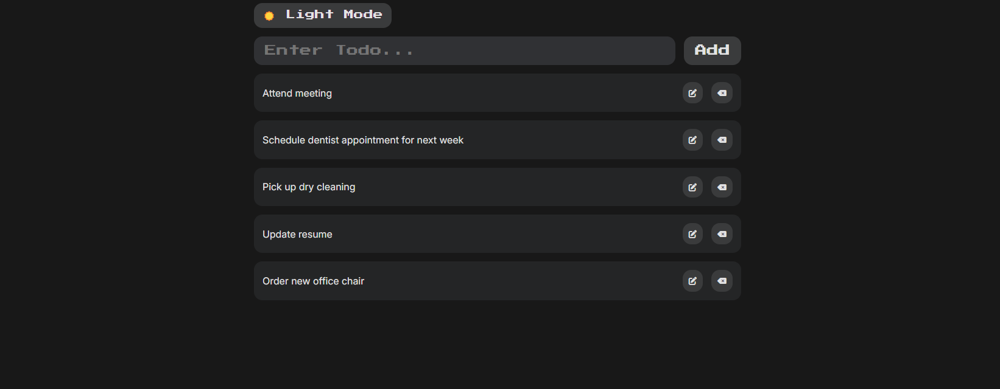

# 📝 Todo List App - React

🚀 A simple and interactive **React-powered Todo List App** for managing daily tasks efficiently.

## 🌐 Live Demo


Check out the deployed app here: [Todo List App on GitHub Pages](https://ali-mashni.github.io/todo-app/)

## ✨ Features
- ✅ **Add & Remove Tasks** – Easily manage your to-do list.
- 🌙 **Dark Mode Toggle** – Switch between light and dark themes.
- 💾 **Persistent Storage** – Saves tasks and theme preferences using `localStorage`.
- ⚡ **Fast & Responsive** – Built with React and Vite for smooth performance.
- 🎨 **Styled with CSS** – Clean and modern UI design.

## 🛠️ Tech Stack
- **React** (Component-based UI)
- **Vite** (Fast build tool)
- **CSS** (Custom styles for responsiveness)
- **localStorage** (For data persistence)

## 📂 Installation & Usage
```sh
# Clone the repository
git clone https://github.com/Ali-Mashni/todo-app.git

# Navigate to the project folder
cd todo-app

# Install dependencies
npm install

# Start the development server
npm run dev  # If using Vite
npm start    # If using Create React App
```

## Project Structure

```sh
src/
├── App.jsx
├── main.jsx
├── index.css
